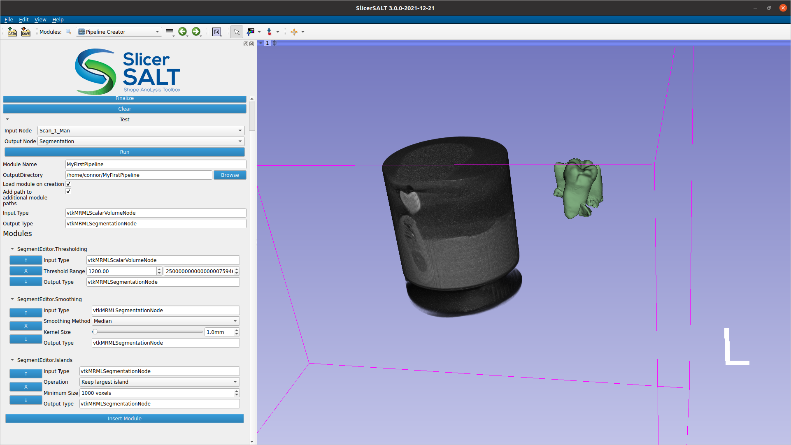
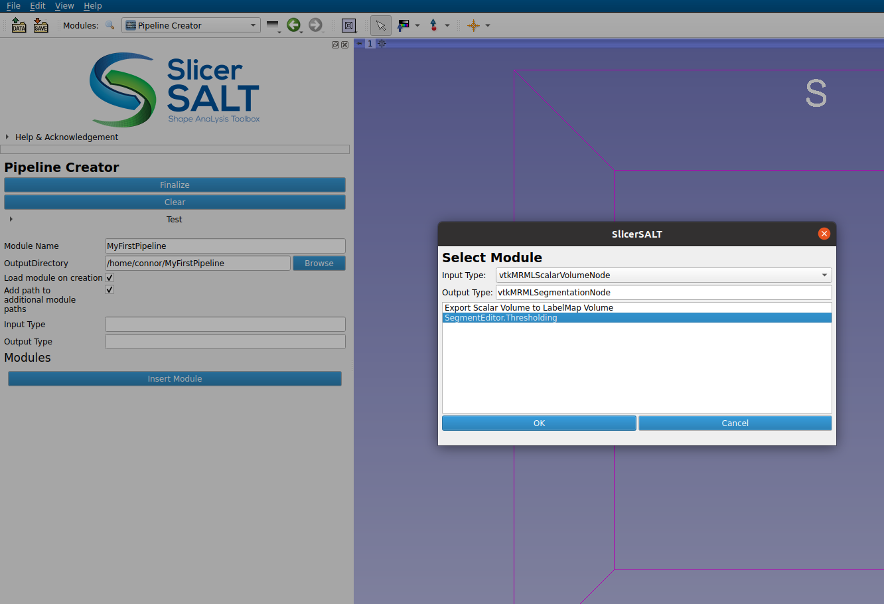
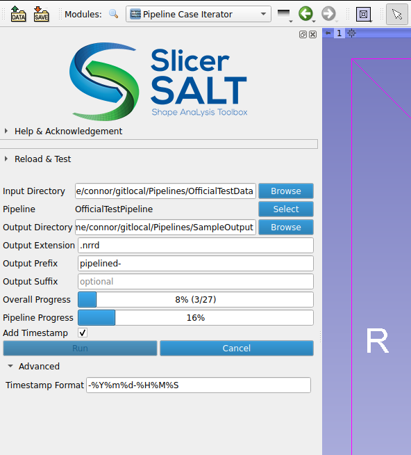

SlicerPipelines
---------------

SlicerPipelines is an extension for 3D Slicer for creating and executing simple modules (aka pipelines) via a GUI interface with no coding knowledge needed.

  

## Overview

The SlicerPipelines extension allows to create and execute simple linear workflows using the `PipelineCreator` and the `PipelineCaseIterator` modules.

The design and implementation of this extension was initially motivated to simplify the creation of shape analysis workflow specific to the SlicerSALT community.

## Features

* **Simple**: Create and execute pipelines with a few clicks.
* **Composable**: Pipelines are themselves modules available as "steps" to create new pipelines.
* **Extensible**: Regular Slicer module modules, python functions, or executable can be registered as pipeline steps.

## Modules

| Name | Description |
|------|-------------|
| [PipelineCreator](PipelineCreator) | Allows for the creation of pipelines via a GUI interface. |
| [PipelineCaseIterator](PipelineCaseIterator) | Allows for automated running of a pipeline over all files in a directory via a GUI interface |
| [PipelineModules](PipelineModules) | Support the registration of "wrappers" providing the steps used in the creation of pipelines by the `PipelineCreator` module. |
| [PipelineCLIBridge](PipelineCLIBridge) | Bridge the gap between the CLI C++ interface and the Python code of the `PipelineCreator`. |

_:warning: This extension is under active development. Its content, API and behavior may change at any time. We mean it!_

## Tutorials

### Creating a pipeline using the Pipeline Creator module

1. To add steps to your pipeline, press the **Insert Module** button in the `Pipeline Creator`. This will show a window where you can select the item you want to add.
2. **Pick the item** you want, fill in its parameters, and then **select the next item** in the pipeline.
3. You need to **repeat** this process until the pipeline has all the steps in your workflow.
4. Once all the steps have been appropriately captured in your pipeline interface, you can **fill in the remaining fields** like name and output directory.
5. Press **Finalize** and the pipeline will be created.

:bulb: You should be able to find your new pipeline in the modules dropdown under a `Pipeline Modules` folder, as well as in the **Insert Module** pop up of the Pipeline Creator, so you can use the new module as a piece in a future pipeline.

## Screenshots

|  |  |
|--|--|
| _PipelineCreator depicting a pipelines composed of three `SegmentEditor` steps `Thresholding`, `Smoothing` and `Island`._ | _Popup dialog for adding a pipeline step in the PipelineCreator module._ |

|  |
|--|
| _`PipelineCaseIterator` showing the progress toward the execution of a pipeline over 27 cases._ |

## Resources

To learn more about Slicer, SlicerSALT, and Slicer extensions, check out the following resources.

 - https://slicer.readthedocs.io/en/latest/
 - https://salt.slicer.org/
 - https://slicer.readthedocs.io/en/latest/user_guide/extensions_manager.html

## License

This software is licensed under the terms of the [Apache Licence Version 2.0](LICENSE).

